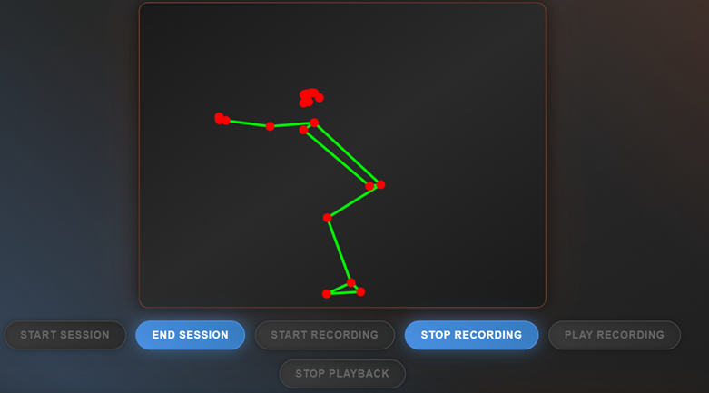
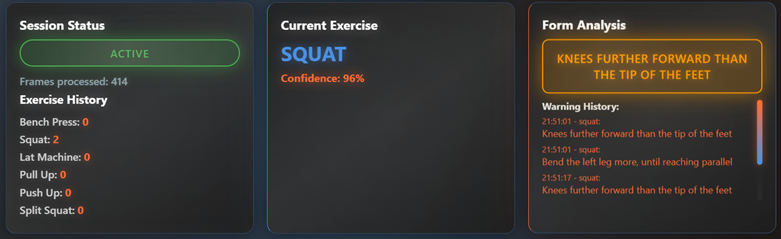
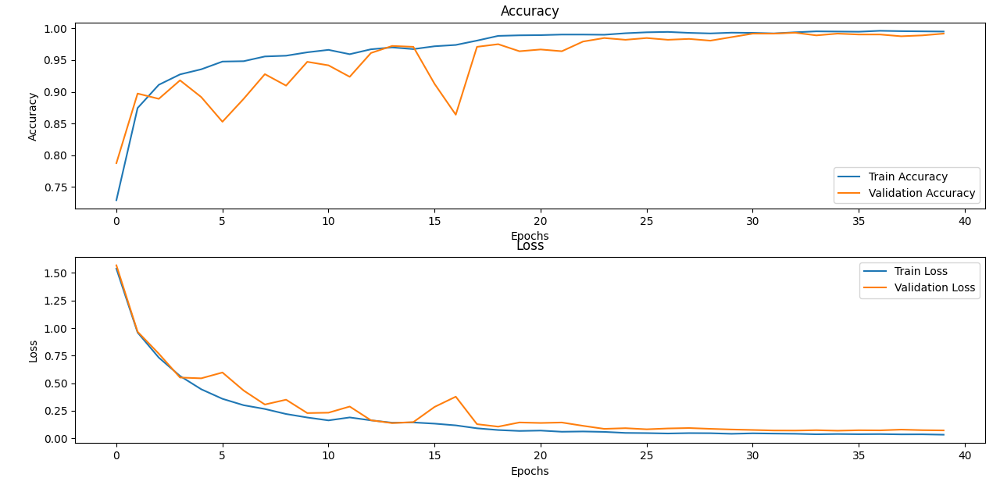

# AI Gym Tracker

**AI Gym Tracker** is a real-time exercise analysis system designed to enhance workout feedback and performance monitoring. It leverages **MediaPipe** for accurate pose detection, a **Bidirectional LSTM** model for exercise classification, and **rule-based logic** using thresholds and local minima to assess the quality of each repetition. To ensure accessibility and ease of use, the entire system is integrated into a **user-friendly web application**.





## 1. Prerequisites
- Python 3.8+ (tested with Python 3.11.4)
- Dependencies listed in ```requirements.txt```
- Modern browser with WebRTC support (Chrome recommended for optimal functioning with Mediapipe)
- ngrok (optional, for public WebApp exposure)
- Machine with multi-core processor (Intel i5/AMD Ryzen 5 or higher) with minimum 4GB RAM
- Working webcam: integrated or external with minimum recommended resolution of 640x480 or higher


## 2. Installation
### Clone the project from Github
```bash
git clone https://github.com/hannesvgel/gym_tracking.git
```

### Install Dependencies
Create a virtual environment
```bash
cd gym_tracking
python -m venv .venv
```

Activate the venv
- Windows 
    ```bash
    .venv\Scripts\activate
    ```
- macOS/Linux
    ```bash
    source .venv/bin/activate
    ```

Install the needed Dependencies
```bash
pip install -r requirements.txt
```


## 3. Usage
To start the web app, navigate to the project root and run:
```bash
python app.py
```
The server will start on http://localhost:8000 and automatically open the browser;
If it doesn't open automatically, click on the link http://localhost:8000 shown in the terminal


## 4. Project Structure & Purpose
**Project goal:** Development of a system to descriminate different gym exercises and the correctness of execution. Two models were created, one able to discriminate between 3 different exercises and the other one between 6 exercises. This was done in order to make the classification task more difficult for the model: in fact, the last three exercises were paired to the first three because of a similar execution. The paired exercises are: squat and split squat, push-up and bench press, pull-up and lat pull-down. In this way the model created is better in discriminate between different movements.
Then, the evaluation of the performance correctness is done using some parameters like, for example, the joint angle of a certain articulation.
A web app has been finally created as interface between our models and the user.

Below is a visualization of the project structure, along with explanations of its key components:
```css
gym_tracking/           # root
├── data/               # different dataset, functions for pre-processing & validation
├── models/             # versions of the trained models (lstm & cnn) for exercise classification
├── notebooks/          # simple notebooks to quickly test models & validate extracted skeletons
├── src/                # code for training models, evaluating exercises & realime inference
├── static/             # web application frontend
├── app.py              # main flask server
├── config.yaml         # config containing models, classes and paths to the datasests
├── README.md       
├── requirements.txt    # required dependencies
```

The following subsections describe the main building blocks of the code and pipeline, from data acquisition to the final web app.


### 4.1 Datasets & Pre-Processing
```css
gym_tracking/
├── data/               # different dataset, functions for pre-processing & validation
│   ├── aquisition      # script to download datasets from kaggle
|   ├── pre-processing  # functions to extract frames from videos, crop videos, balance dataset, ...
|   ├── processed       # final datasets with mediapipe extraxted keypoints stored as CSVs
├── ...
```

All datasets and data processing are managed within the `data` folder, which contains the following subdirectories:
- ``aquisition`` holds a simple script used to download the [workout videos](https://www.kaggle.com/datasets/philosopher0808/gym-workoutexercises-video) and [workout images](https://www.kaggle.com/datasets/hasyimabdillah/workoutexercises-images) datasets from Kaggle.
- `pre-processing` contains various helper functions used for: splitting videos into CSVs of 30 frames with MediaPipe skeleton landmarks for LSTM training, converting 30-frame CSVs into single-frame CSVs for CNN training, combining and balancing different datasets, and more.
- `processed` contains the finalized datasets, including both 30-frame and single-frame CSVs, as well as a combined dataset used for training the final LSTM model.

Our raw data consisted of exercise videos. We used [MediaPipe](https://ai.google.dev/edge/mediapipe/solutions/vision/pose_landmarker?hl=de) for pose estimation, extracting skeletons from each frame. Each skeleton is represented by 33 landmarks, each with x, y, z coordinates and a visibility value. For training our LSTM model, we used sequences of 30 consecutive frames of these landmarks to capture temporal information.

The following subsections explain how each individual dataset — our [own](https://drive.google.com/drive/folders/1H9mTOb1FsfSzcLXhqJkY6SCRLRxz_LK-), the [Kaggle dataset](https://www.kaggle.com/datasets/philosopher0808/gym-workoutexercises-video), and the [Fit3D dataset](https://fit3d.imar.ro/) — were acquired, processed, and ultimately combined into the final dataset.

#### 4.1.1 Our Dataset
**Data Acquisition:**
1) We used three phone webcams in a fixed reference system
2) We considered different subjects
3) Every subject executed different possible exercises (split squat, bulgarian squat, push-up, pull-up, lat pull-down, bench press)
4) Every subject executed multiple series (correct and wrong execution) of the same exercise

**Description:** At the end of the acquisition phase, we had collected videos for each subject and each exercise performed. Each video contained multiple repetitions of the same movement. The final Exercises were split squat, bulgarian squat, push-up, pull-up, lat pull-down & bench press.


#### 4.1.2 Kaggle Workout Videos Dataset
**Data Acquisition:** simply download the Dataset from Kaggle by running ``data\aquisition\download_kaggle_ds.py``.

**Description:** This dataset consists of workout videos organized by exercise type, with each folder named after the corresponding workout. The videos are in `.mp4` format, sourced primarily from YouTube and supplemented with original recordings. Video resolution and duration vary, but each video contains at least one repetition of the exercise.

#### 4.1.3 Fit3D Dataset
**Data Acquisition:** Download the dataset from [https://fit3d.imar.ro/download](https://fit3d.imar.ro/download). Access must be requested, but if one uses a university email for academic purposes, approval is typically granted almost immediately.

**Description:**  
The Fit3D dataset is a large-scale collection designed for 3D human pose, shape, and motion analysis in fitness training. It contains over 3 million images and corresponding 3D ground-truth data, covering 47 exercises performed by both instructors and trainees. The dataset features recordings from multiple subjects using a marker-based motion capture system, captured from four camera angles at 900x900 resolution and 50 fps. Each recording includes segmented exercise repetitions, 3D skeletons with 25 joints, and aligned mesh models (GHUM and SMPLX). For our application we utilized the raw video recordings.

#### 4.1.4 Pre-Processing
The pre-processing steps involved were similar for all datasets and included:
1) Manually trimming the videos to include only repetitions of a single exercise, removing any introductory or concluding sequences from each video.
2) Processing the videos into CSV files, where each file contains segments of 30 consecutive frames of MediaPipe skeleton landmarks. This is handled by ``data\pre-processing\video_seg_processing.py``.
3) Combining and balancing the datasets (see *4.1.5* below)

#### 4.1.5 Combining the Datasets
Each of the three datasets covered different exercises, with some overlap between them. To create a balanced final dataset, we selected samples from all three sources. We excluded the Bulgarian squat from our dataset and replaced it with the standard squat from the other datasets, as the Bulgarian squat proved problematic during training and classification—primarily due to its sensitivity to camera angle, which was a result of being consistently recorded from the same viewpoint during data acquisition. As a result, our final dataset focuses on the following exercises:
- bench press
- lat machine
- pull up
- push up
- split squat
- squat

The diagram below illustrates how the final dataset is assembled from the different sources. The merging process is managed by the script `data/pre-processing/combine_dataset.py`.


To ensure that no exercise was overrepresented and to minimize bias in the dataset, we performed horizontal flipping of the landmarks for selected examples from our own dataset. This augmentation was applied only where necessary, primarily because our dataset was slightly biased toward a particular camera angle. Flipping the data effectively simulated a different viewpoint. In the end, each exercise class in the combined dataset contained 800 examples. The flipping and class balancing are performed using the script `data/pre-processing/balance_dataset.py`. 

The final combined dataset is located under ``data/processed/combined_DS/v3/30_frame_segments``.


### 4.2 Exercise Classification

The illustration below highlights the key subdirectories and scripts used for classification, along with a brief description of their purpose:
```css
gym_tracking/       
├── ...
├── models/                     # versions of the trained models (lstm & cnn) for exercise classification
├── notebooks/                  # simple notebooks to quickly test models & validate extracted skeletons
├── src/                        # code for training models, evaluating exercises & realime inference
│   ├── ...
│   ├── models                  # train functions for DL models
│   │   ├── multiple_frames
│   │   │   ├── train_lstm.py   # main training script for the lstm model 
│   ├── realtime inference      # scripts for realtime exercise classification
├── config.yaml                 # config containing models, classes and paths to the datasests
├── ...
```

Training of the LSTM model is performed using `src/models/multiple_frames/train_lstm.py`. The pipeline is illustrated below:


The model achieved **99% accuracy** on the test set. The training curves for loss and accuracy are shown below:


The final trained models (`*.h5` files) are stored in the `models` directory. Model paths, class labels, and dataset locations are specified in `config.yaml`—this configuration is used by the web app, the `notebooks` (for quick testing and validation), and the scripts in `src/realtime_inference` (for running local classification without the web app or exercise evaluation).


### 4.3 Exercise Evaluation & Web App
```css
gym_tracking/
├── ...
├── models/             # versions of the trained models (lstm & cnn) for exercise classification
├── static/             # web application frontend
├── app.py              # main flask server
├── config.yaml         # config containing models, classes and paths to the datasests
├── ...
```


#### 4.3.1 ngrok installation
Download ngrok from https://ngrok.com/ and register in order to obtain an authtoken, which has to be configured:
```bash
ngrok config add-authtoken YOUR_AUTHTOKEN
```
Run then ``app.py``. Open a terminal in the section where you extracted ngrok and enter the commands:
```bash
.\ngrok.exe authtoken YOUR_TOKEN # To activate the public tunnel
.\ngrok.exe http http://localhost:8000 # To generate the public link
```
ngrok will provide a random public URL (e.g. https://e0b2-5-90-143-228.ngrok-free.app) accessible from any device.


#### 4.3.2 Web App User Guide
After launching the web app and opening the browser at the provided link, you will see the following elements:

1. **Camera selection:** Choose a camera from the dropdown menu (if multiple cameras are available).
2. **Video display:** The video feed from the selected camera appears in the main section.
3. **Start Session:** Resets counters and variables, and starts the real-time analysis session.
4. **Pose detection:** The system tracks the user's posture, displaying a green and red "skeleton" in a box below the video.
5. **Exercise recognition:** After collecting 30 consecutive frames, the system automatically identifies the exercise with the highest confidence and displays its name in the "Current Exercise" section.
6. **Real-Time Feedback:**
    - **Form analysis:** The system continuously evaluates each frame for execution correctness, showing feedback in the "Form Analysis" section:
        - Green: "Correct Execution!" when the exercise is performed correctly.
        - Orange: Specific warnings to correct posture.
        - Gray: Neutral state.
    - **Audio feedback:** Vocal warnings are played for posture corrections, and a high-pitched sound confirms each correct repetition.
7. **Progress Monitoring & Exercise History:**
    - The system counts correct repetitions for each exercise and updates a list automatically.
    - Warning History: All warnings are recorded with timestamps in the "Warning History" section.
    - Session Status: Displays the number of processed frames and the session status.
8. **Recording Functions:**
    - **Start Recording:** Begin recording poses during training.
    - **Stop Recording:** Stop recording.
    - **Play Recording:** Review recorded movements. The pose detection box will display a blue and purple skeleton to replay all recorded movements for visual feedback (note: press "Stop Recording" and "End Session" before playback).
    - **Stop Playback:** Stop playback of saved poses.
    - **End Session:** Ends the analysis.


#### 4.3.3 Troubleshooting

1. **"Model not available"**
    - Ensure that `lstm_bidir_6cl.h5` is present in the main directory.
    - Check that TensorFlow is installed correctly.

2. **Webcam not detected**
    - Grant camera permissions to the browser if requested.
    - Try a different browser (Chrome is recommended for optimal Mediapipe performance).
    - Verify that no other application is using the webcam.
    - Try selecting another camera from the list of available ones.

3. **Slow performance**
    - Close other applications that intensively use CPU/GPU, as MediaPipe and TensorFlow can consume significant resources.
    - Use Chrome for optimal performance with MediaPipe.
    - Adjust the `modelComplexity` parameter in the Mediapipe configuration:
        - `modelComplexity: 0` — computationally lighter but less accurate.
        - `modelComplexity: 1` — balanced.
        - `modelComplexity: 2` — very accurate but computationally heavy.

4. **Installation and ngrok connection issues**
    - Allow Windows Defender Firewall to install the `ngrok.exe` file if it gets blocked due to antivirus conflicts.
    - Verify your internet connection.
    - Restart ngrok if the tunnel becomes unstable.
    - Note: Ngrok with a free account has traffic limitations. Sessions expire after 2 hours; after this time, reload the site page.

5. **Classification and movement quality analysis**
    - The quality of analysis depends on lighting and framing:
        - For optimal classification and rule-based analysis, frame the left profile of the subject during Squat, Split Squat, Push Up, and Lat Pull-down, and the right profile during Pull Up and Bench Press.
        - To improve Mediapipe detection, position yourself in a well-lit environment, wear tight-fitting clothes, and ensure a uniform background with strong contrast to the subject.


## 5. Limitations
**TODO**
- Video acquisition quality
- Joints extraction accuracy
- Limited dataset
- We had to change some exercises along the way and then used online dataset/make data augmentations
- Model misclassifications 
- Model Limited to predefined classes


## 6. Future Developments
**TODO**
- A larger dataset is needed to make the model more robust - more repetitions and more subjects
- 3D reconstruction from multiple point of view
- A more accurate model for the skeleton extraction
- Enhance the number of physical exercises that the model can recognize and discriminate
- Increase the number of parameters for a more complete quality evaluation
- ...


## 5. Authors
- Coluccino Edoardo (10630619)
- Freddo Sara (10740747)
- Girolami Francesca (10689084)
- Vogel Hannes (11109115)
